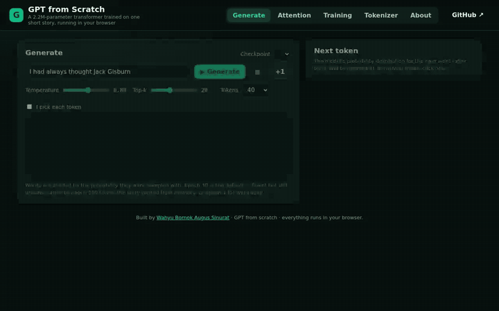

# GPT-like — a GPT built from scratch, running in your browser

[](https://officiel-tinkerthink.github.io/GPT-like/)
[](#tests)

A decoder-only transformer (GPT-2 architecture: token + positional embeddings, pre-LayerNorm blocks with causal
multi-head attention, GELU feed-forward, untied output head) implemented from scratch in PyTorch — plus a
**browser app that runs a tiny trained model in plain JavaScript** so you can watch it predict, steer it word by word,
inspect every attention head and see how it learned over 300 epochs.

**▶ Try it: <https://officiel-tinkerthink.github.io/GPT-like/>** — no install, no server, no GPU. The whole model
(2.2M parameters, int8-quantised, ~2.5 MB per checkpoint) is downloaded once and evaluated in your tab.



## What you can do in the demo

| Tab | What it shows |
| --- | --- |
| **Generate** | Streams text token by token. Every generated word is shaded by its sampled probability, and the side panel shows the **next-token distribution** (after top-k + temperature). Tick *I pick each token* to steer the story yourself, or press **+1** for a single step. The *memorisation* meter reports how much of the output is copied verbatim from the training story. |
| **Attention** | The causal attention matrix of any layer/head for the text you just generated, with hover tooltips, plus thumbnails of the layer’s four heads (16 in total across 4 layers). |
| **Training** | The real loss curve from `tools/train_tiny.py` (train vs validation) with milestone samples — watch the model go from word soup at epoch 1 to fluent (and overfitted) prose at epoch 300. |
| **Tokenizer** | The repo's word-level `SimpleTokenizerV2` applied live to whatever you type: token ids and `<|unk|>` handling. |
| **Checkpoint selector** | Switch between epochs 1 → 300 on the Generate tab and regenerate the same prompt to compare. |

The model is deliberately tiny and trained on a single short story (Edith Wharton's *The Verdict*, 4.7k tokens),
so it memorises rather than generalises — which is exactly what makes the training curve and the temperature /
top-k controls instructive.

## Architecture

```
tokens ─► tok_emb + pos_emb ─► dropout
        ┌─────────────────── × n_layers ───────────────────┐
        │ x = x + MultiHeadAttention(LayerNorm(x))  (causal)│
        │ x = x + FeedForward(LayerNorm(x))         (GELU)  │
        └───────────────────────────────────────────────────┘
        ─► LayerNorm ─► Linear(emb_dim, vocab) ─► logits
```

| File | Contents |
| --- | --- |
| `model/gpt_model.py` | `GPTModel`, `TransformerBlock`, `LayerNorm` |
| `model/attention.py` | `SelfAttention` → `CausalAttention` → `MultiHeadAttention` (the build-up from the book) |
| `utils/layer.py` | `GELU`, `FeedForward` |
| `tokenizer/tokenizer.py` | `SimpleTokenizerV1/V2` — regex word-level tokenizer with `<|unk|>` and `<|endoftext|>` |
| `dataset/dataset.py` | sliding-window `GPTDatasetV1` / `create_dataloader_v1` |
| `utils/loss.py`, `utils/tokenize.py` | cross-entropy helpers, `generate_text_simple` |
| `configs/config.yaml` | GPT-2 small / medium / large / XL configs (124M – 1.5B) |

## Training & inference

```bash
pip install torch tiktoken pyyaml matplotlib

# GPT-2 small (124M) with the tiktoken BPE tokenizer — the original training script
python tools/train.py --model GPT_CONFIG_124M

# The tiny word-level model used by the web demo (4 layers, 192-d, 64-token context; ~10 min on CPU)
python tools/train_tiny.py --epochs 300 --out checkpoints

# Sample from a checkpoint with temperature / top-k
python tools/infer.py --checkpoint checkpoints/tiny_ep300.pt --prompt "He was silent" --temperature 0.8 --top_k 20

# Export int8 weights + manifest for the browser app
python tools/export_web.py checkpoints docs/model
```

### How the browser inference works (`docs/js/gpt.js`)

* Weight matrices are stored as **int8 with one fp32 scale per output row**; vectors (biases, LayerNorm, positional
  embeddings) stay fp32. `Model.linear` dequantises on the fly.
* Generation uses a **KV cache** — each new token costs one forward step, not a full re-encode. When the context
  window fills up the model re-primes on the last 64 tokens.
* Every head's attention row is kept so the Attention tab can render it without a second pass.
* Sampling mirrors `tools/infer.py` exactly: top-k on the logits, then temperature softmax (T = 0 → greedy).

## Tests

```bash
npm test                                # JS engine: tokenizer parity, PyTorch logit parity, KV cache, attention rows, sampling
python -m unittest discover tests       # tokenizer round-trip, model shapes, generate(), GELU vs torch
```

`docs/model/manifest.json` carries reference logits produced by PyTorch for the final checkpoint; the JS test
reproduces the top-5 within int8 tolerance and the same greedy token.

## Fixes made along the way

* `GPTModel` built the positional embedding with `emb_dim` rows instead of `context_length` → crashed for any config
  where the two differ.
* Custom `GELU` used the constant `0.44715` instead of `0.044715`.
* `SimpleTokenizer.decode` raised `KeyError` — `int_to_str` was built with keys and values swapped.

## Layout

```
docs/            static web app (GitHub Pages)  · docs/model = exported weights
tools/           train.py · train_tiny.py · infer.py · export_web.py
tests/           gpt.test.js · test_tiny_gpt.py
assets/          demo.gif · demo.mp4 · screenshots
```

Based on the architecture described in *Build a Large Language Model (From Scratch)* by Sebastian Raschka.
